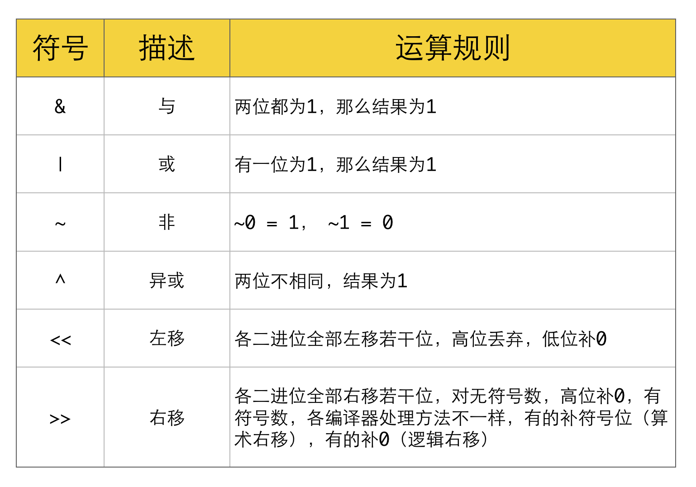

# LeetCode
力扣有点烦
5. 最长回文子串  
   longestPalindrome5

11. 盛最多水的容器  给你 n 个非负整数 a1，a2，...，an，每个数代表坐标中的一个点 (i, ai) 。在坐标内画 n 条垂直线，垂直线 i 的两个端点分别为 (i, ai) 和 (i, 0) 。找出其中的两条线，使得它们与 x 轴共同构成的容器可以容纳最多的水。
    maxArea11   

15. 三数之和  给你一个包含 n 个整数的数组 nums，判断 nums 中是否存在三个元素 a，b，c ，使得 a + b + c = 0 ？请你找出所有和为 0 且不重复的三元组。
    threeSum15
    
21. 合并两个有序链表（递归）  将两个升序链表合并为一个新的 升序 链表并返回。新链表是通过拼接给定的两个链表的所有节点组成的。
    MergeTwoSortedLists21

22. 括号生成  数字 n 代表生成括号的对数，请你设计一个函数，用于能够生成所有可能的并且 有效的 括号组合。
    generateParenthesis22
   
33. 搜索旋转排序数组(二分查找法)  给你 旋转后 的数组 nums 和一个整数 target ，如果 nums 中存在这个目标值 target ，则返回它的下标，否则返回 -1 。
    rotatedarray33
    
34. 在排序数组中查找元素的第一个和最后一个位置(二分查找法) 给定一个按照升序排列的整数数组 nums，和一个目标值 target。找出给定目标值在数组中的开始位置和结束位置。 如果数组中不存在目标值 target，返回 [-1, -1]。
    searchRange34

45. 跳跃游戏 II
    jump45    

46. 全排列   给定一个不含重复数字的数组 nums ，返回其 所有可能的全排列 。你可以 按任意顺序 返回答案。
    permutations46

55. 跳跃游戏（动态规划）   给定一个非负整数数组 nums ，你最初位于数组的 第一个下标 。 数组中的每个元素代表你在该位置可以跳跃的最大长度。 判断你是否能够到达最后一个下标
    canJump55
    
62. 不同路径 （动态规划）
    uniquePaths62

70. 爬楼梯  假设你正在爬楼梯。需要 n 阶你才能到达楼顶。 每次你可以爬 1 或 2 个台阶。你有多少种不同的方法可以爬到楼顶呢？
    climbingsolution70

74. 搜索二维矩阵(二分查找)  编写一个高效的算法来判断 m x n 矩阵中，是否存在一个目标值。该矩阵具有如下特性： 每行中的整数从左到右按升序排列。 每行的第一个整数大于前一行的最后一个整数。
    searchMatrix74

77. 组合  给定两个整数 n 和 k，返回范围 [1, n] 中所有可能的 k 个数的组合。
    combinations77

82. 删除排序链表中的重复元素 II 存在一个按升序排列的链表，给你这个链表的头节点 head ，请你删除链表中所有存在数字重复情况的节点，只保留原始链表中 没有重复出现 的数字。
    rmduplicates82

91. 解码方法 (动态规划)
    numDecodings91

117. 填充每个节点的下一个右侧节点指针 II（深度，广度） 填充它的每个 next 指针，让这个指针指向其下一个右侧节点。如果找不到下一个右侧节点，则将 next 指针设置为 NULL。
     populatingnode117

120. 三角形最小路径和（动态规划）  给定一个三角形 triangle ，找出自顶向下的最小路径和。 每一步只能移动到下一行中相邻的结点上。相邻的结点 在这里指的是 下标 与 上一层结点下标 相同或者等于 上一层结点下标 + 1 的两个结点。也就是说，如果正位于当前行的下标 i ，那么下一步可以移动到下一行的下标 i 或 i + 1 。
    triangle120

130. 被围绕的区域（bfs,dfs）   给你一个 m x n 的矩阵 board ，由若干字符 'X' 和 'O' ，找到所有被 'X' 围绕的区域，并将这些区域里所有的 'O' 用 'X' 填充。
     surroundedRegions130

136. 只出现一次的数字  给定一个非空整数数组，除了某个元素只出现一次以外，其余每个元素均出现两次。找出那个只出现了一次的元素。
     singleNumber136

139. 单词拆分(动态)
     wordBreak139

153. 寻找旋转排序数组中的最小值   给你一个元素值 互不相同 的数组 nums ，它原来是一个升序排列的数组，并按上述情形进行了多次旋转。请你找出并返回数组中的 最小元素
     rotatedarray153
     
162. 寻找峰值  给你一个输入数组 nums，找到峰值元素并返回其索引。数组可能包含多个峰值，在这种情况下，返回 任何一个峰值 所在位置即可。
     findPeak162

190. 颠倒二进制位  颠倒给定的 32 位无符号整数的二进制位。
     reverseBits190
     
191. 位1的个数（位运算） 编写一个函数，输入是一个无符号整数（以二进制串的形式），返回其二进制表达式中数字位数为 '1' 的个数（也被称为汉明重量）。
     hammingWeight191 

198. 打家劫舍(动态规划) 你是一个专业的小偷，计划偷窃沿街的房屋。每间房内都藏有一定的现金，影响你偷窃的唯一制约因素就是相邻的房屋装有相互连通的防盗系统，如果两间相邻的房屋在同一晚上被小偷闯入，系统会自动报警。
     houserobber198
     
200. 岛屿数量（深度优先算法，广度优先算法）    给你一个由 '1'（陆地）和 '0'（水）组成的的二维网格，请你计算网格中岛屿的数量。 岛屿总是被水包围，并且每座岛屿只能由水平方向和/或竖直方向上相邻的陆地连接形成。
     numIslands200

202. 快乐数 (hash)
     isHappy202

209. 长度最小的子数组    给定一个含有 n 个正整数的数组和一个正整数 target 。 找出该数组中满足其和 ≥ target 的长度最小的 连续子数组 [numsl, numsl+1, ..., numsr-1, numsr] ，并返回其长度。如果不存在符合条件的子数组，返回 0 。
     minSubArrayLen209

213. 打家劫舍 II（动态规划）   首尾相连
     rob213

231. 2 的幂 给你一个整数 n，请你判断该整数是否是 2 的幂次方。如果是，返回 true ；否则，返回 false 。
     PowerOfTwo231     

300. 最长递增子序列 (动态)
     lengthOfLIS300

322. 零钱兑换  
     coinChange322

413. 等差数列划分 （动态）
     numberOfArithmeticSlices413

438. 找到字符串中所有字母异位词  给定两个字符串 s 和 p，找到 s 中所有 p 的 异位词 的子串，返回这些子串的起始索引。不考虑答案输出的顺序。
    findAnagrams438

547. 省份数量  有 n 个城市，其中一些彼此相连，另一些没有相连。如果城市 a 与城市 b 直接相连，且城市 b 与城市 c 直接相连，那么城市 a 与城市 c 间接相连。
     findCircleNum547
     
572. 另一棵树的子树（DFS）  给你两棵二叉树 root 和 subRoot 。检验 root 中是否包含和 subRoot 具有相同结构和节点值的子树。如果存在，返回 true ；否则，返回 false 。
     isSubtree572
     
583. 两个字符串的删除操作
     minDistance583

673. 最长递增子序列的个数
     findNumberOfLIS673

713. 乘积小于K的子数组 给定一个正整数数组 nums和整数 k 。 请找出该数组内乘积小于 k 的连续的子数组的个数。
     numSubarrayProduct713
     
784. 字母大小写全排列 给定一个字符串S，通过将字符串S中的每个字母转变大小写，我们可以获得一个新的字符串。返回所有可能得到的字符串集合。
    letterCasePermutation784

797. 所有可能的路径 (dfs)  给一个有 n 个结点的有向无环图，找到所有从 0 到 n-1 的路径并输出
     allPathsSourceTarget797

844. 比较含退格的字符串    给定 S 和 T 两个字符串，当它们分别被输入到空白的文本编辑器后，判断二者是否相等，并返回结果。 # 代表退格字符。
     backspaceCompare844
     
986. 区间列表的交集   给定两个由一些 闭区间 组成的列表，firstList 和 secondList ，其中 firstList[i] = [starti, endi] 而 secondList[j] = [startj, endj] 。每个区间列表都是成对 不相交 的，并且 已经排序 。
    intervalIntersection986

1091. 二进制矩阵中的最短路径  (bfs)
      shortestPathBinaryMatrix1091

1143. 最长公共子序列
      longestCommonSubsequence1143

